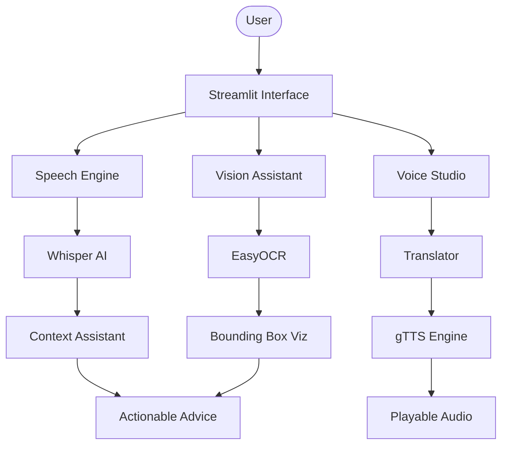

# 🌊 AudioVision: Multimodal Intelligence Hub

[](https://audiovisionv1.streamlit.app/)
[](https://www.python.org/downloads/)
[](https://opensource.org/licenses/MIT)

**AudioVision** is a sleek, modern multimodal AI application that bridges the gap between Speech, Vision, and Natural Language Processing. Built with a high-performance dark-themed UI, it serves as an all-in-one suite for real-time transcription, live translation, and intelligent optical character recognition.

---

## 🚀 Core Features

### 🎤 1. Speech Engine (The Communications Hub)
* **Universal Transcription:** Powered by OpenAI's Whisper (Tiny), offering high-accuracy speech-to-text.
* **Multilingual Translation:** Instant cross-lingual transcription. Select your source and target languages to hear in one language and read in another.
* **Context Assistant:** An integrated NLP layer that analyzes your speech to provide summaries, intent detection (Health, Productivity, etc.), and actionable next steps.

### 🔊 2. Voice Studio (The Content Creation Hub)
* **Text-to-Speech (TTS):** Convert any text into high-fidelity AI voices using gTTS.
* **Global Translation:** Translate text across 20+ languages before generating audio output.
* **Parallel Processing:** Implements concurrent threading to generate long audio files significantly faster than standard implementations.

### 🖼️ 3. Vision Assistant (The Optical Intelligence Hub)
* **Multi-Lang OCR:** Specialized support for English and major Indian languages (Hindi, Telugu, Tamil, Kannada, Malayalam, Marathi, Bengali, Urdu).
* **Intelligent Bounding Boxes:** Visualizes detected text with confidence scores and localized boxes.
* **Auto-Read:** Automatically converts detected text into speech for enhanced accessibility.

---

## 🛠️ Tech Stack

| Layer | Technology |
| :--- | :--- |
| **Frontend** | Streamlit (Custom CSS & Glassmorphism) |
| **Speech-to-Text** | OpenAI Whisper (Tiny), Google STT Fallback |
| **Vision/OCR** | EasyOCR, OpenCV (Headless) |
| **NLP/Translation** | Deep-Translator, Custom Keyword Intent Engine |
| **Text-to-Speech** | gTTS (Parallelized via ThreadPoolExecutor) |
| **Visualizations** | Plotly (Waveform & Frequency Spectrum) |

---

## 📂 Project Structure

```text
.
├── app.py                # Main Streamlit Application UI
├── requirements.txt      # Python Dependencies
├── packages.txt          # System Dependencies (FFmpeg)
├── static/
│   └── style.css         # Modern Dark-Mode Styling
├── modules/              # Logic Engines
│   ├── speech_to_text.py
│   ├── translation.py
│   ├── text_to_speech.py
│   ├── ocr_module.py
│   ├── context_assistant.py
│   └── waveform_visualizer.py
└── utils/                # Helper Utilities
    ├── file_manager.py
    └── error_handler.py
```

---

## ⚙️ Installation & Local Setup

1. **Clone the repository:**
   ```bash
   git clone [https://github.com/Chandra-16/AudioVision.git](https://github.com/Chandra-16/AudioVision.git)
   cd AudioVision
   ```

2. **Create a virtual environment:**
   ```bash
   python -m venv venv
   source venv/bin/activate  # On Windows: venv\Scripts\activate
   ```

3. **Install dependencies:**
   ```bash
   pip install -r requirements.txt
   ```

4. **Run the application:**
   ```bash
   streamlit run app.py
   ```

---

## 📐 System Architecture



---

## 🔮 Roadmap (v2.0)
- [ ] **LLM Integration:** Moving from a rule-based Context Assistant to a fully generative Gemini model.
- [ ] **Custom Voice Cloning:** Integrating specialized TTS models for personalized voice synthesis.
- [ ] **Real-time Camera Reader:** Optimized webcam frame processing for live OCR.

---

## 📄 License
Distributed under the MIT License.

---

### Developed with ❤️ by [Chandra](https://github.com/Chandra-16)